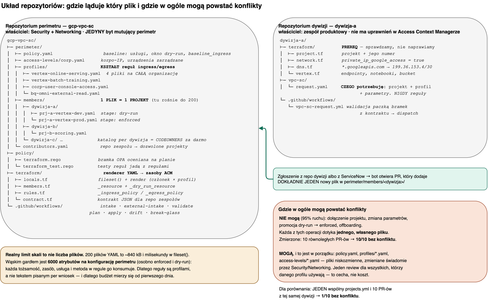

# 6 · Układ repozytoriów przy 100–200 projektach

Strona do rozmowy z architektem, gdy pada pytanie: *czy naprawdę plik na projekt, bo tego będzie za dużo?*
Odpowiedź jest pomiarem, nie preferencją.

Źródło do edycji: [`diagrams/D5-struktura-folderow.drawio`](diagrams/D5-struktura-folderow.drawio) ·
przepływ zgłoszenia w mermaidzie: [`diagrams/D5-struktura-folderow.mmd`](diagrams/D5-struktura-folderow.mmd)

## Co gdzie ląduje

| Co | Gdzie | Właściciel | Jak często się zmienia |
|---|---|---|---|
| członkostwo projektu | [`perimeter/members/<dywizja>/<projekt>.yaml`](../template/perimeter/members/) — **1 plik = 1 projekt** | Security + Networking (treść pisze bot z wniosku) | ciągle: 200 wpisów, ruch codzienny |
| kształt reguł ingress/egress | [`perimeter/profiles/*.yaml`](../template/perimeter/profiles/) — **4 pliki na całą organizację** | Security + Networking | rzadko, świadomie |
| baseline i access levels | [`perimeter/policy.yaml`](../template/perimeter/policy.yaml.example), [`access-levels/`](../template/perimeter/access-levels/) | Security + Networking | rzadko |
| renderer YAML → zasoby ACM | [`terraform/`](../template/terraform/) | platforma | rzadko |
| **prereq sieciowy** (PGA, strefa DNS na restricted VIP) | `terraform/` w repo **dywizji** | dywizja | jak jej infrastruktura |
| **wniosek** dywizji | `vpc-sc/request.yaml` w repo **dywizji** | dywizja | raz na projekt |

Granica wynika z odpowiedzialności, nie z wygody: **automatyzujemy granicę, prereq tylko weryfikujemy.**
Kto zmienia trasy i strefy DNS w cudzym środowisku, ten odbiera telefon, gdy tam cokolwiek przestanie
działać — także z powodów niezwiązanych z perimetrem.

## Pomiar zamiast dyskusji

200 istniejących projektów, 10 równoległych PR-ów, każdy dodaje jeden projekt:

| Układ | PR-ów bez konfliktu |
|---|---|
| jeden `projects.yml`, projekty z różnych dywizji | 9/10 |
| jeden `projects.yml`, 10 PR-ów z **tej samej** dywizji | **1/10** |
| jeden plik + `merge=union` | 10/10 — ale cicho duplikuje wpis przy edycji |
| **plik na projekt** (210 plików, 840 kB) | **10/10** |

Do odtworzenia: [`experiments/konflikty-ukladow/`](../experiments/konflikty-ukladow/README.md). Tam też jest
opis, dlaczego `merge=union` zamienia konflikt widoczny na cichy — i jaka bramka jest przy nim obowiązkowa.

## Trzy odpowiedzi na trzy typowe zarzuty

**„Będzie 200 plików w jednym katalogu."** Płaski katalog wytrzymuje 200 plików bez problemu i tak wygląda
renderer, który tu leży: `fileset("…/members", "*.yaml")` czyta JEDEN poziom. Sharding po dywizji
(`members/<dywizja>/<projekt>.yaml`) jest lepszy przy większej skali — `CODEOWNERS` robi się wtedy sam —
ale **wymaga zmiany renderera**: wzorzec na `**/*.yaml` i klucz `for_each` z `replace(f, "/", "-")`.
To zmiana ADRESÓW zasobów w stanie, więc idzie osobnym PR-em z `moved{}`, nie w przelocie.

**„Chcę widzieć całość w jednym miejscu."** To jest argument za jednym plikiem **wynikowym**, nie źródłowym.
Wynik już istnieje i nie trzeba go generować osobnym jobem: `terraform output members_enforced` oraz
`members_dry_run_only` dają pełną listę, a kontrakt JSON (`contract.tf`) publikuje ją dla innych repozytoriów.
Przegląd całości jest, konfliktów w źródle nie ma.

**„To i tak nie skaluje się do 200 projektów."** Nie skaluje się **liczba i złożoność reguł**, nie liczba
plików: limit to **6000 atrybutów na konfigurację perimetru**, liczony osobno dla enforced i dry-run. 200
plików YAML to ~840 kB i milisekundy w `fileset()`. Dlatego reguły są profilami, a budżet mierzy się od
pierwszego dnia (`tools/attribute_budget.py`).

## Wersja dla odbiorcy zewnętrznego

Gotowy przykład obu repozytoriów (włącznie z `network.tf` i `dns.tf` po stronie dywizji) leży w katalogu
`examples/vpc-sc-multirepo/` repozytorium, w którym ten starter jest publikowany. Tamten katalog jest
**snapshotem do pokazania** — pełnym, ale zamrożonym; źródłem prawdy dla treści merytorycznej jest ten
dokument i kod startera.
